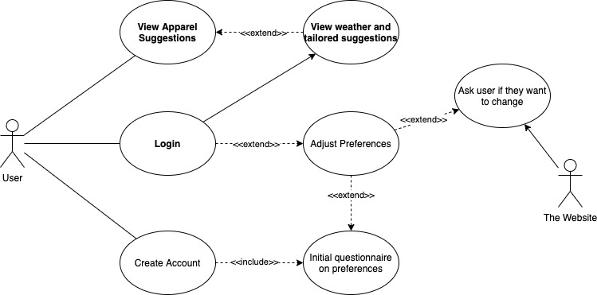
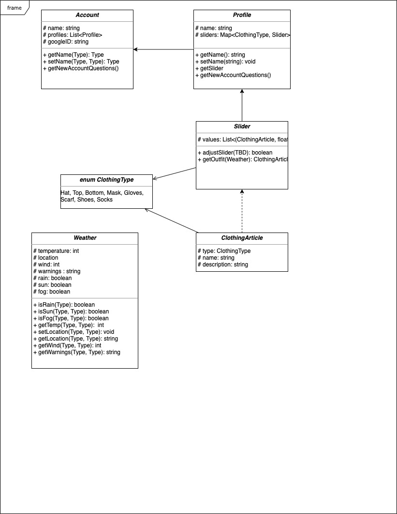

# Cozy Frontend

Have you ever been poorly dressed for the weather? Never again, with the Cozy App! This app takes in either the user’s location data or a city entered by the user to retrieve the corresponding weather data. Based on this weather data and the user’s customizable temperature/outfit preferences, this app makes suggestions to the user regarding what outfit they should wear for the current weather!

This repository contains the frontend for this app.

## Setting up your development environment

### Running the app

Ensure that you've already set up the [backend](https://github.com/Team-Cozy/Weather-Backend) and that it is running.

Then, run

```
npm install
```

to install dependencies, and

```
npm run start
```

to start the development server.

## Tests

To run tests, simply execute

```
npm run test
```

## Style Guide

Our JavaScript code follows the [AirBnB style guide](https://github.com/airbnb/javascript). See our [`.eslintrc`](./.eslintrc) for more details.

## Use Case Diagram (Last Updated 02/03/2021)



## UML Class Diagram (Last Updated 02/12/2021)



## Additional links

- Figma [UI Prototype](https://www.figma.com/file/NH1r8TgbBm1EXlKbMCFY1Y/?node-id=0%3A10) (last updated February 12)
- [Backend](https://github.com/Team-Cozy/Weather-Backend)
